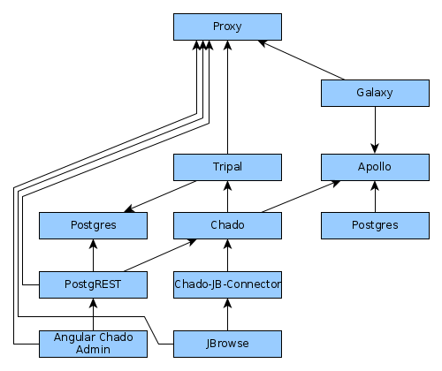
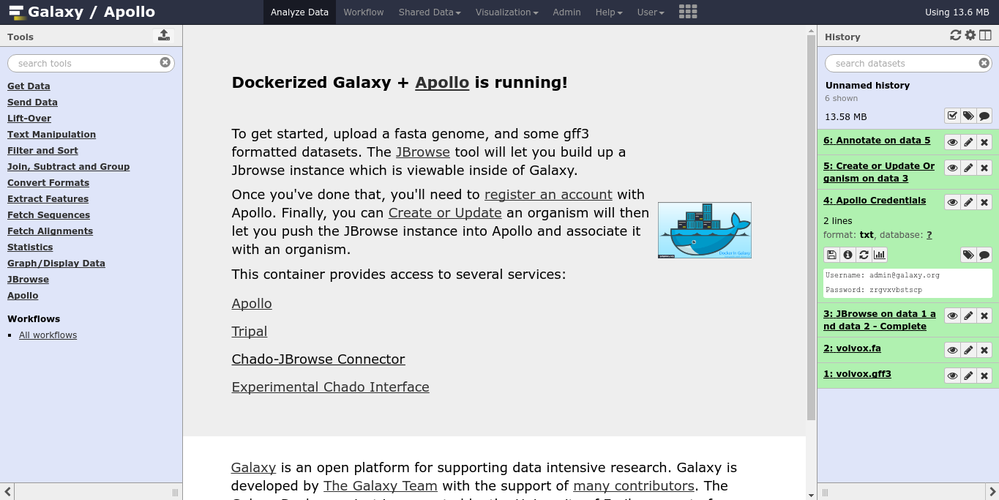
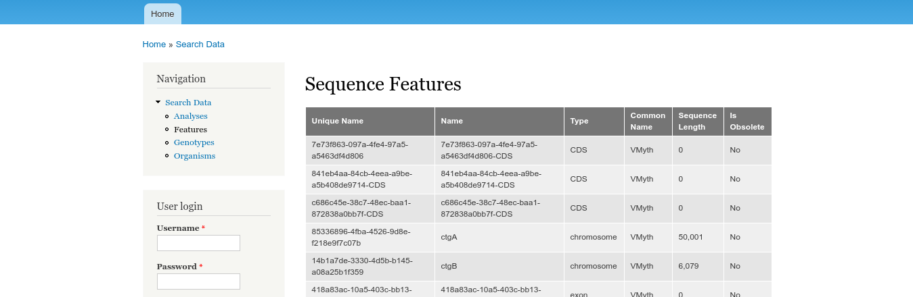
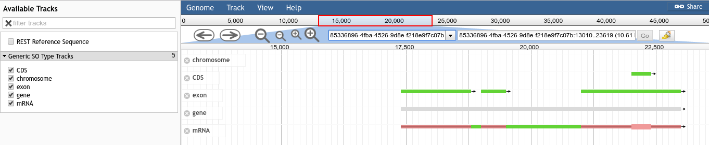

# Galaxy/Apollo

This docker-compose.yml file specifies all of the infrastructure needed to run
the current iteration of GMOD products.

We have attempted to include as many "bells and whistles" as possible, which
means this approaches the level of "tech-demo" and away from something you
might wish to deploy as-is. That said, the deployment is very easy to customise
and adapt to your particular organisation's needs.



## Screenshots

**Galaxy** ...



... allows you to load data in **Apollo**,


which in turn can be exported to **Chado** and **Tripal**.



But wait, there's more! Data in Chado is made available in **JBrowse**




## Running

```console
$ docker-compose pull # Pull all images
$ docker-compose up -d apollo_db tripal_db # Launch the DBs
```

In a new terminal, in the same folder, run `docker-compose logs -f` in order to
watch what is going on.

```
$ docker-compose up -d tripal # Wait for tripal to come up and install Chado.
$ # It takes a few minutes. I believe you'll see an apache error when ready.
$ docker-compose up -d # This will bring up the rest of the services.
```

## Services:

Service                          | Address
-------------------------------- | ----
Galaxy                           | :8200
Tripal (/tripal)                 | :8200/tripal
Apollo (through Galaxy, /apollo) | :8200/apollo
Chado JBrowse Connector          | :8200/jbrowse/
PostgREST                        | :8200/postgrest
PostGraphQL Graph*i*QL interface | :8200/graphiql
PgAdmin4                         | :8201/
Chado PostGraphQL Connector      | :8200/jbrowse_graphql/

## Credentials

Service | Username         | Password
------- | ---------------- | ---------
Galaxy  | admin@galaxy.org | admin
Tripal  | admin            | changeme
Apollo  | admin@local.host | password

The Apollo account is only used internally by the Galaxy tools. You should be automatically logged in with your Galaxy account when connecting to Apollo (thanks to [gx-cookie-proxy](https://github.com/erasche/gx-cookie-proxy)).

## Dependencies

This `docker-compose.yml` depends on a large number of containers. We link some
build status images here for developer convenience

Image               | Status
-----               | ------
galaxy              | 
postgrest           | 
postgraphql         | [](https://hub.docker.com/erasche/postgraphql)
chado-jb-connector  | 
chado               | 
tripal              | 
gx-cookie-proxy     | 

## Configuring

Each Docker image can be configured to fit your needs. You should consult the documentation of each image, in particular:

[Galaxy Docker image documentation](https://github.com/bgruening/docker-galaxy-stable)

[Tripal Docker image documentation](https://github.com/galaxy-genome-annotation/docker-tripal)

[Chado Docker image documentation](https://github.com/galaxy-genome-annotation/docker-chado)

[Apollo Docker image documentation](https://github.com/galaxy-genome-annotation/docker-apollo)

## LICENSE

GPLv3

## Support

This material is based upon work supported by the National Science Foundation under Grant Number (Award 1565146)
