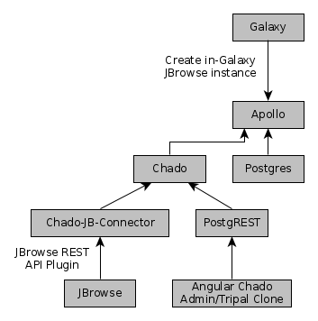

# Galaxy/Apollo

This docker-compose.yml file specifies all of the infrastructure needed to run
a linked Galaxy and Apollo instance.




## Running

```
$ docker-compose up -d
$ docker-compose logs
```

## Services:

Service                          | Port
-------------------------------- | ----
Galaxy                           | 8200
Tripal (/tripal)                 | 8200/tripal
Apollo (through Galaxy, /apollo) | 8200/apollo
PostgREST                        | 8300
Angular Chado Admin              | 8200/chado/
Chado JBrowse Connector          | 8200/jbrowse/

## Credentials

Service | Username         | Password
------- | ---------------- | ---------
Galaxy  | admin@galaxy.org | admin
Tripal  | admin            | changeme

## LICENSE

GPLv3
