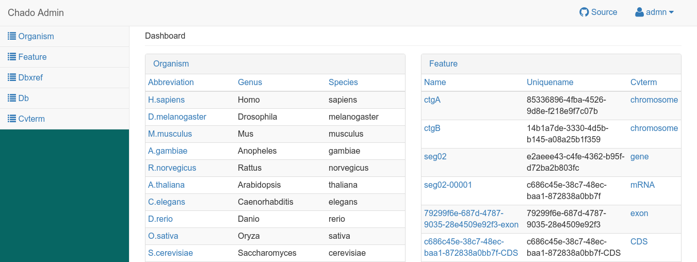

# Galaxy/Apollo

This docker-compose.yml file specifies all of the infrastructure needed to run
the current iteration of GMOD products.

We have attempted to include as many "bells and whistles" as possible, which
means this approaches the level of "tech-demo" and away from something you
might wish to deploy as-is. That said, the deployment is very easy to customise
and adapt to your particular organisation's needs.


## Screenshots

**Galaxy** ...


... allows you to load data in **Apollo**,


which in turn can be exported to **Chado** and **Tripal**.


But wait, there's more! Data in Chado is made available in **JBrowse**


and an experimental, AngularJS Chado Interface




## Running

```
$ docker-compose up -d
$ docker-compose logs
```

## Services:

Service                          | Port
-------------------------------- | ----
Galaxy                           | 8200
Tripal (/tripal)                 | 8200/tripal
Apollo (through Galaxy, /apollo) | 8200/apollo
PostgREST                        | 8300
Angular Chado Admin              | 8200/chado/
Chado JBrowse Connector          | 8200/jbrowse/

## Credentials

Service | Username         | Password
------- | ---------------- | ---------
Galaxy  | admin@galaxy.org | admin
Tripal  | admin            | changeme

## LICENSE

GPLv3
